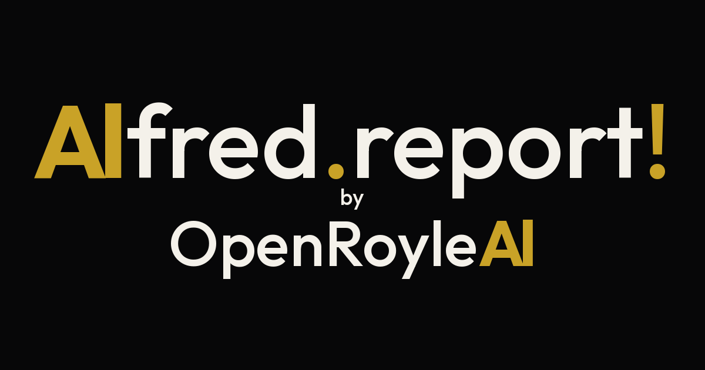

<p align="center">
  <a href="https://alfred.report">
    
  </a>
</p>

<p align="center">
  <strong>Alfred.report</strong><br />
  Voice-first operator on Cloudflare<br />
  <em>Alfred, report!</em>
</p>

<p align="center">
  <a href="https://alfred.report"></a>
  <a href="https://alfred.report/signup"></a>
  <a href="https://deploy.workers.cloudflare.com/?url=https://github.com/OpenRoyleAl/Alfred.report"></a>
</p>

---

Alfred is a personal operator that runs on the edge. You wake him with **Alfred, report!** He answers with a short brief, keeps missions moving, and stays out of the way when nothing needs a decision.

The product lives at **[alfred.report](https://alfred.report)**. This repository is the open source for the Cloudflare Worker face, static site, and CLI packages.

## Try it

| | |
| --- | --- |
| Product | [alfred.report](https://alfred.report) |
| Hear the brief | [Speak it](https://alfred.report/) on the home page |
| iPhone + Siri | [alfred.report/iphone](https://alfred.report/iphone) |
| Agent discovery | [llms.txt](https://alfred.report/llms.txt) · [OpenAPI](https://alfred.report/api/openapi.json) |

## Stack

- **Cloudflare Workers** + Durable Objects
- **Static face** under `public/` (landing, auth pages, demo audio)
- **TypeScript** Worker entry in `src/`
- **Wrangler** config in `wrangler.jsonc`
- Optional local harness in `packages/alfred-pi`

## Deploy

```bash
git clone https://github.com/OpenRoyleAl/Alfred.report.git
cd Alfred.report
npm install
npx wrangler deploy
```

Or use the **Deploy to Cloudflare** button above.

Secrets (API keys, Stripe, JWT, Google OAuth) belong in **Cloudflare Secrets Store** or `wrangler secret put`. Do not put values in the repo.

```bash
# examples — names only; values stay in the dashboard / Secrets Store
npx wrangler secret put XAI_API_KEY
npx wrangler secret put JWT_SECRET
```

## Local development

```bash
npm install
npm run dev
```

Copy secrets into a local `.dev.vars` file (gitignored) when you need full auth and billing paths.

## Repository layout

```
public/          Marketing site, audio demo, agent discovery files
src/             Worker, routes, Durable Object, APIs
packages/        alfred-pi and related open packages
wrangler.jsonc   Cloudflare Worker config
```

## License

MIT. See [LICENSE](./LICENSE).

---

<p align="center">
  <a href="https://alfred.report">alfred.report</a>
  · OpenRoyleAl
</p>
